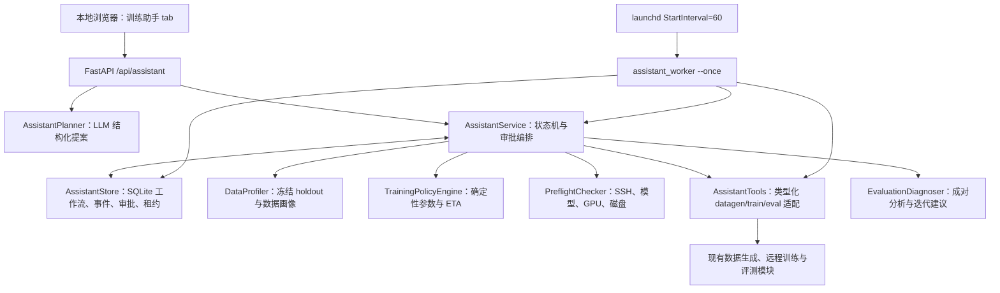

# 个人训练助手设计规格

日期：2026-08-19

范围：`llamafactory_pipeline`
状态：待用户最终确认后实施

## 1. 目标

在现有 LlamaFactory 数据生成、远程训练、评测和部署能力之上，增加一个仅供仓库所有者本人使用的个人训练助手。助手负责理解训练需求、制定数据方案、生成训练参数、完成服务器预检、在用户批准后启动任务、定时监控、发起 A/B 评测，并根据对照结果提出下一轮数据或训练方案。

系统不把 LLM 当作可以任意执行命令的控制器。LLM 只负责需求理解、方案生成和结果解释；状态迁移、参数合并、资源校验、审批和远程操作由确定性 Python 代码执行。

## 2. 已确认边界

- 只有一个本地用户，不引入账号、组织、RBAC 或租户隔离。
- 第一版只管理一个 `RemoteConfig` 所指向的训练服务器。
- Web 服务仍只监听 `127.0.0.1`，不对外暴露。
- 数据构建、训练、A/B 评测和新一轮迭代都是有副作用操作，必须有当前方案 hash 绑定的单次用户批准。
- 助手不自动停止运行中的训练，不自动删除 checkpoint、数据集或模型产物。
- 第一版不实现多服务器调度、并发 GPU 队列、贝叶斯超参搜索或自动全参训练。
- 训练和评测仍由现有 SSH/Docker/nohup 机制持久运行；助手不持有远程训练进程。
- 定时监控使用独立的 `launchd StartInterval=60` 任务，每次执行一轮到期检查后退出，不占用聊天请求进程。

## 3. 非目标

- 不用助手取代 LlamaFactory，也不实现新的训练框架。
- 不让 LLM 直接生成或执行 shell 命令。
- 不在第一版引入 Redis、Celery、Temporal 或 PostgreSQL。
- 不在助手内训练一个新的参数预测模型。
- 不把训练 loss 下降作为唯一成功标准。
- 不用训练数据本身作为最终 A/B 评测集。

## 4. 现有能力复用与新建边界

| 类型 | 能力 | 处理方式 |
|---|---|---|
| 直接复用 | `DatagenConfig`、QA/QA-multi/FC、SFT/DPO prompt、Judge、去重、任务报告 | 由助手生成并校验 `DatagenConfig`，批准后调用 `datagen_job.create_and_launch()` |
| 直接复用 | SSH/SCP、GPU 选择、nohup、PID/exit_code、日志、checkpoint | 通过类型化工具适配器调用 `remote.py` |
| 直接复用 | 基座/微调模型评测、FC 工具名和参数评分、主观打分 | 延伸对照统计和诊断，不重写远程推理 |
| 适配 | 训练提交 | 从 `app.py` 抽出无 HTTP 依赖的 `train_service.submit_training_job()`，供原 API 和助手共用 |
| 适配 | 训练 Schema | 补充 DPO、QLoRA、FlashAttention、packing、有效 token 吞吐和稳定性参数 |
| 适配 | GPU 查询 | 增加空闲显存、温度、功耗和活跃进程摘要 |
| 适配 | 评测产物 | predictions 增加延迟、finish_reason、无效输出原因；报告增加成对差值和切片 |
| 新建 | 持久工作流、审批、事件和计时任务 | SQLite 存储和显式状态机 |
| 新建 | 需求解析、数据方案、参数策略、预检、诊断 | 小而独立的模块，所有 LLM 输出经 Pydantic 和确定性规则二次校验 |
| 新建 | 个人助手界面 | 在现有单页增加“训练助手” tab 和独立 `assistant.js` |

## 5. 总体架构



## 6. 工作流状态机

### 6.1 状态

```text
collecting_requirements
data_plan_ready
data_generating
data_review
train_plan_ready
preflight_blocked
train_ready
training
train_failed
ab_plan_ready
evaluating
diagnosis_ready
completed
```

### 6.2 关键转移

| 当前状态 | 事件 | 新状态 | 是否需批准 |
|---|---|---|---|
| `collecting_requirements` | 需求完整并生成数据方案 | `data_plan_ready` | 否 |
| `data_plan_ready` | 启动数据构建 | `data_generating` | 是：`start_datagen` |
| `data_generating` | 生成成功并冻结 holdout | `data_review` | 否 |
| `data_generating` | 一个或多个子任务失败 | `data_plan_ready` | 否；生成仅含失败项的重试方案，重启仍需批准 |
| `data_review` | 数据画像通过并生成训练方案 | `train_plan_ready` | 否 |
| `train_plan_ready` | 运行远程预检 | `train_ready` 或 `preflight_blocked` | 否，只读 |
| `preflight_blocked` | 资源或参数已修正 | `train_plan_ready` | 否 |
| `train_ready` | 启动训练 | `training` | 是：`start_training` |
| `training` | 训练成功 | `ab_plan_ready` | 否 |
| `training` | 训练失败或中断 | `train_failed` | 否 |
| `train_failed` | 生成恢复方案 | `train_plan_ready` | 否 |
| `ab_plan_ready` | 启动基线/挑战者评测 | `evaluating` | 是：`start_evaluation` |
| `ab_plan_ready` | 用户跳过评测 | `completed` | 是：`skip_evaluation` |
| `evaluating` | 推理、打分和诊断完成 | `diagnosis_ready` | 否 |
| `diagnosis_ready` | 接受新模型 | `completed` | 是：`accept_candidate` |
| `diagnosis_ready` | 开始下一轮 | `data_plan_ready` | 是：`start_iteration` |

非表中转移一律拒绝。同一工作流可以同时展示互斥选择（例如“开始 A/B”与“跳过 A/B”），但数据库同时只允许一个有副作用动作进入 `executing`；一个选择执行成功后，其余同状态的 pending 审批全部标记为 `stale`。

## 7. 审批和幂等

每个可批准动作都持久化：

```json
{
  "approval_id": "apr_20260819_a1b2c3",
  "workflow_id": "wf_20260819_d4e5f6",
  "action": "start_training",
  "plan_hash": "sha256:0123456789abcdef0123456789abcdef0123456789abcdef0123456789abcdef",
  "summary": "Qwen3.5-9B LoRA SFT, GPU 0, 3 epochs",
  "status": "pending"
}
```

- `plan_hash` 由 `{action, plan, decision_warnings}` 的规范化 JSON 计算，确保动作、用户看到的方案和影响决策的预检告警与实际执行内容相同；GPU 利用率等瞬时原始证据不进入 hash。
- 点击批准后，数据库先原子地把状态从 `pending` 改为 `executing`；只有抢占成功的请求能调用工具。
- 外部任务创建成功后写入 `job_id/eval_id` 并把审批标记为 `consumed`。
- 外部调用失败则标记为 `failed`，展示脱敏错误，同一方案重试需新的批准。
- 方案修改后 hash 变化，旧审批自动失效。
- 对互斥决策可同时生成多张审批卡；原子 claim 以 workflow 为互斥范围，避免并发点击启动两个分支。

## 8. 持久化模型

SQLite 默认位于 `llamafactory_pipeline/assistant_state/assistant.sqlite`，该路径已被现有 `*.sqlite` 规则忽略。数据库启用 WAL、foreign keys 和 `busy_timeout=5000`。

### 8.1 表

- `workflows`：当前状态、迭代次数、目标、数据方案、数据画像、训练方案、预检、A/B 方案、诊断和外部任务 ID。
- `messages`：用户/助手消息，仅属于一个 workflow。
- `events`：追加式事件流，用于时间线、通知和审计。
- `approvals`：单次审批及其方案 hash。
- `scheduled_actions`：到期时间、租约、尝试次数、幂等键和载荷。
- `training_runs`：按 train job 保存模型规模、GPU、stage、cutoff、量化方式、初始/校准 ETA、实际时长和吞吐，用于后续个人任务校准。

### 8.2 存储原则

- 所有 JSON 在写入前通过 Pydantic 验证。
- 所有时间使用 UTC ISO-8601。
- 每次状态转移与对应 `events` 插入处于同一数据库事务。
- `scheduled_actions.idempotency_key` 唯一，格式为 `<workflow_id>:<action>:<external_job_id>:<milestone>`。
- 工作流、数据版本、训练 job 和 eval run 只做关联，不复制大体积产物到 SQLite。

## 9. 需求理解与数据方案

### 9.1 `TrainingObjective`

必填信息：

- `goal`：希望改善的模型行为。
- `task_types`：`qa | qa_multi | fc` 的非空集合。
- `base_model_path`：远程模型路径。
- `template`：训练和推理必须使用的 LlamaFactory template，默认为当前 Qwen3.5 的 `qwen3_5_nothink`。
- `baseline`：`base_model` 或已有训练 job。
- `data_source`：数据构建使用的知识库目录、Milvus collection 或 FC 种子文件；每个请求的 task type 必须有匹配来源（QA=`kb_source_dir`、QA-multi=`collection`、FC=`fc_seed_file`）。第一版助手始终通过现有数据构建功能产生带血缘的新数据版本，不把一个无构建报告的已注册数据集直接当作新 workflow 产物。
- `success_criteria`：主指标、最小改善值和不可回归指标。

可选信息：数据预算、训练时间预算、希望 SFT/DPO、错误样例、重要业务切片。

LLM 每次输出 `RequirementExtraction`：`assistant_reply`、`objective`、`missing_fields`、`ready`。只有 `ready=true` 且对象通过 Pydantic 校验时才进入数据方案。

### 9.2 `DataPlan`

`DataPlan` 包含一个 `items` 列表；每个请求的 `task_type` 对应一个 `DataPlanItem`，每项包含一个可直接交给现有数据生成子系统的 `DatagenConfig` 和用户可读的选型理由。计划级字段包括：

- `holdout_ratio`，默认 `0.10`。
- `validation_ratio`，默认 `0.10`，作为训练集内部 `val_size`。
- `split_seed=42`。
- 覆盖、接地、去重、FC 错误类型和 DPO 对质量要求。
- 总体选型理由、预计尝试数和风险。

对于同一 workflow 包含多个 `task_type` 的需求，第一版为每个 task type 创建独立数据生成子任务，完成后合并训练数据和评测数据；不把多个 task type 硬塞入一个 `DatagenConfig`。同一 workflow 的所有数据子任务必须使用同一种 `finetune_type`，不在一个训练产物中混合 SFT 与 DPO schema。

LLM 生成方案后，确定性校验器必须保证 task type 恰好覆盖目标且不重复、总样本数不超过用户预算、显式指定的 SFT/DPO 不被更改，并用 `TrainingObjective.data_source` 覆盖 LLM 返回的来源字段，禁止模型发明输入路径或 collection。

### 9.3 冻结 holdout

数据生成完成后按 `split_seed` 确定性打乱：

- 样本数小于 30：holdout 取 20%，报告标记“只适合烟测，不足以做稳定统计结论”。
- 样本数 30–199：holdout 数为 `max(20, round(n * holdout_ratio))`。
- 样本数不小于 200：holdout 数为 `round(n * holdout_ratio)`。
- holdout 从训练 JSON 中移除，FC 记录与 QA/QA-multi 记录分别转为 `function_call` 和 `subjective` 评测集，分别注册到 evalset 库；不把两种格式混在同一评测文件。
- 训练文件、holdout 文件、数据方案和生成报告的 SHA-256 写入 workflow 事件。

## 10. 数据画像

`DatasetProfile` 至少包含：

- SFT/DPO、QA/FC 类型、训练文件和各评测文件的 hash。
- 训练样本数、holdout 样本数、请求/实际 holdout 比例、训练内 validation 比例和 split seed。
- 文本长度字符数 P50/P95/max。
- 估算 token P50/P95/max 及估算方法 `cjk_char_ascii4_v1`。
- 在 512/1024/2048/4096/8192 cutoff 下的估算截断率。
- 完全重复率、空文本数、非法工具调用数。
- FC 工具名分布；QA 任务的问题/回答长度分布。
- 数据生成接受率和各拒绝原因占比。

token 估算不伪装成模型 tokenizer 的精确结果。第一版在参数解释中标明“估算”，并在训练开始后用实际 step 时间更新 ETA。

## 11. 训练参数策略

### 11.1 确定性默认

| 参数 | SFT | DPO |
|---|---:|---:|
| `stage` | `sft` | `dpo` |
| `finetuning_type` | `lora` | `lora` |
| `lora_rank` | 8 | 8 |
| `lora_alpha` | 16 | 16 |
| `learning_rate` | `1e-4` | `5e-6` |
| `pref_beta` | 不写入 | `0.1` |
| `pref_loss` | 不写入 | `sigmoid` |
| `warmup_ratio` | `0.1` | `0.1` |
| `lr_scheduler_type` | `cosine` | `cosine` |
| `bf16` | GPU 支持时为 true | GPU 支持时为 true |
| `flash_attn` | `auto` | `auto` |
| `include_effective_tokens_per_second` | true | true |

### 11.2 cutoff

1. 取估算 token P95 乘 `1.10`。
2. 向上取 `512, 1024, 2048, 4096, 8192` 中的最小档。
3. 不超过远程模型 `config.json` 声明的上下文上限。
4. 如果预计截断率超过 5%，将结果标为 `WARN`，不静默提交。

### 11.3 epoch

| 训练样本数 | 默认 epoch |
|---:|---:|
| `< 500` | 4 |
| `500–1999` | 3 |
| `2000–9999` | 2 |
| `>= 10000` | 1 |

小于 500 条时必须启用 `val_size`并在方案中显示过拟合风险。

### 11.4 batch 和显存

- 起始 `per_device_train_batch_size=1`。
- SFT 目标 global batch 为 32；DPO 为 16。
- `gradient_accumulation_steps = ceil(target_global_batch / (gpu_count * per_device_batch))`，最小 1、最大 64。
- 官方 LoRA bf16 粗略显存基线取 `2 * model_parameter_billions GB`，叠加 20% 安全余量。DPO 再乘 `1.35`。
- 估算超过选中 GPU 可用显存时，按顺序提议：降低 cutoff；保持 micro batch=1 并增大梯度累积；启用 4-bit QLoRA；多卡 DeepSpeed ZeRO-2/3。
- `full` 或 `freeze` 不由策略引擎自动选择，只接受用户显式覆盖。

### 11.5 参数输出

`TrainingPlan` 同时保存：

- 完整 `TrainConfig`。
- GPU 选择、数据集引用、基线模型和 output_dir 前缀。
- 每个自动填充参数的 `reason` 和 `confidence`。
- 估算 steps、显存、时间区间和风险列表。
- ETA 的 `confidence` 与 `basis`；无相似历史时使用可配置且明确标为低置信度的宽吞吐区间，不把冷启动估计伪装成实测值。
- 审批层根据整个 `TrainingPlan` 计算的方案 hash；hash 不写回 `TrainingPlan` 本身，避免循环计算。

## 12. 远程预检

`PreflightReport` 中的每个 `CheckResult` 都含有 `name`、`status=pass|warn|block`、`summary`、`evidence`、`remediation`。

必须检查：

1. `RemoteConfig` 完整、SSH 可连接。
2. `llamafactory-cli version` 可执行。
3. 容器模式下容器处于 running，且 LlamaFactory、模型和 remote_root 路径在容器内可见。
4. 模型路径、`config.json`和 tokenizer 文件可读。
5. 根据 safetensors 总字节数推导参数规模；无法推导时返回 `WARN` 并要求在界面确认规模。
6. 训练数据格式与 `stage` 匹配，template 非空。
7. GPU 索引存在，可用显存满足估算加安全余量，温度低于 85℃。
8. 选中 GPU 没有另一个本工具的 running train/eval 任务。
9. remote_root 可写，剩余磁盘大于 `2 * dataset_size + 10 GB`。
10. BF16、多卡和 DeepSpeed 组合与当前硬件/启动方式兼容。

存在任一 `block` 时不创建 `start_training` 审批。`warn` 可进入批准，但必须在审批卡中逐条展示。

用户批准训练后、调用远程训练工具前必须再执行一次预检。若出现新的 `block`，进入 `preflight_blocked` 且不启动训练；若告警集合相对获批方案发生变化，旧批准失败并基于新告警生成新的审批卡；只有状态仍非 block 且告警集合不变时才能启动。

## 13. 定时监控和 ETA

### 13.1 调度

- 数据生成运行时：每 60 秒检查。
- 训练前 10 分钟：每 60 秒检查。
- 训练稳定运行：每 180 秒检查。
- 距预计完成小于 10 分钟或出现异常：每 60 秒检查。
- 评测运行时：每 120 秒检查。

`assistant_worker --once` 每轮最多处理 20 个到期任务。领取任务时设置 120 秒租约；进程崩溃后租约过期可重试。

### 13.2 里程碑通知

助手只在以下情况生成新的用户可见事件：

- 训练达到 10%、25%、50%、75%、90%、100%。
- ETA 较上次对外报告变化超过 20%。
- 10 分钟没有新 step，且 GPU 利用率低于 10%。
- loss 为 NaN/Inf，或当前 loss 大于近 20 个点中位数的 3 倍。
- 显存使用超过 95%、GPU 温度不低于 85℃。
- 日志匹配 OOM、NCCL、dataset、tokenizer 或 traceback 失败特征。
- 任务成功、失败或中断。

### 13.3 ETA

```text
global_batch = per_device_train_batch_size * gpu_count * gradient_accumulation_steps
effective_train_records = floor(train_artifact_records * (1 - validation_ratio))
estimated_steps = ceil(effective_train_records * epochs / global_batch)
eta_seconds = remaining_steps / median_recent_steps_per_second
```

- 启动前若存在同模型规模、GPU、stage、量化方式和 cutoff 档位的历史任务，使用历史吞吐分位数给出区间；否则使用 README 中可配置的冷启动吞吐上下界给出宽区间并标记低置信度。
- 至少完成 20 个 step 后，改用近 20 个有效点的中位 steps/s。
- 最终报告保存首次估算、20 step 估算、实际时间和误差，供下次校准。

## 14. A/B 评测与诊断

### 14.1 对照设计

- A 为 objective 中锁定的基座模型或已有冠军 job；B 为当前训练 job。
- 两个模型使用同一 template、system prompt、temperature、token 上限和工具解析器。
- 使用已冻结 holdout，按样本 ID 成对对比。
- FC 报告工具名准确率、参数分数、无工具调用率、无效率和 P50/P95 延迟。
- subjective 报告正确性/完整性综合分、无效率、P50/P95 延迟和成对 win/tie/loss。
- 二元工具名指标使用精确 McNemar 检验；连续分数使用 seed=42 的 2000 次 paired bootstrap 差值区间。

### 14.2 默认验收门槛

- FC 主指标：B 工具名准确率至少不低于 A，且参数均分提升不小于 0.15。
- subjective 主指标：B 均分提升不小于 0.15。
- 无效率不得增加超过 1 个百分点。
- 任一标记为 critical 的切片不得下降超过 2 个百分点或 0.10 分。
- holdout 小于 30 时不自动给出“显著提升”结论，只提供方向性和逐例结果。

门槛可由用户在 objective 中改写，改写后进入方案 hash。

所有门槛都按指标原生量纲的绝对差值解释：准确率/无效率的 `0.02` 表示 2 个百分点，1–5 分制的 `0.15` 表示 0.15 分，不使用相对百分比。`SuccessCriteria` 分开保存关键切片的 rate 回归阈值（默认 `0.02`）和 score 回归阈值（默认 `0.10`），并可用 `non_regression_metrics` 为工具名准确率等次要指标设置最小允许差值。

### 14.3 诊断类别

`EvaluationDiagnosis` 只使用以下类别：

- `accept_candidate`：达到主指标且无关键回归。
- `data_coverage_gap`：失败集中在某工具、意图或业务切片。
- `annotation_or_pair_quality`：参数标注不一致，或 DPO chosen/rejected 差距不可信。
- `template_or_protocol_mismatch`：空工具、无效 JSON、格式错误或大量截断。
- `underfit`：训练 loss 无有效下降且主要切片无改善。
- `overfit`：训练 loss 持续下降，但验证/A/B 回归扩大。
- `evaluation_quality_issue`：judge 无效率高、标签冲突或评测样本不足。

诊断引擎先运行规则，再让 LLM 将证据和规则结果组装为用户可读报告。LLM 不能把规则未支持的原因写成已确认事实。

### 14.4 迭代限制

- 一个 workflow 最多进入 3 轮训练迭代。
- 每轮必须创建新的 dataset version、train job 和 eval run，不覆盖上一轮。
- 连续两轮主指标改善小于设定门槛时，助手停止提议自动迭代，要求人工复盘需求和评测集。

## 15. 工具边界

`AssistantTools` 只暴露以下类型化方法：

```python
class AssistantTools:
    def start_datagen(self, workflow_id: str, plan: DataPlan) -> list[dict[str, str]]:
        raise NotImplementedError

    def inspect_datagen(self, launches: list[dict[str, str]]) -> list[dict]:
        raise NotImplementedError

    def start_training(self, workflow_id: str, plan: TrainingPlan) -> str:
        raise NotImplementedError

    def inspect_training(self, job_id: str) -> dict:
        raise NotImplementedError

    def start_evaluation(self, workflow_id: str, req: EvalRequest, plan: EvaluationPlan) -> str:
        raise NotImplementedError

    def inspect_evaluation(self, eval_id: str) -> dict:
        raise NotImplementedError

    def score_evaluation(self, eval_id: str) -> dict:
        raise NotImplementedError
```

上述方法的参数都是已验证的 Pydantic 对象或服务端生成的安全 ID。不接收任意 shell、任意远程路径或 LLM 生成的未经校验字典。

## 16. API

使用 `assistant_api.py` 的 FastAPI `APIRouter(prefix="/api/assistant")`：

- `POST /workflows`：用首条用户消息创建 workflow，返回 workflow 快照。
- `GET /workflows`：列出最近 workflow。
- `GET /workflows/{workflow_id}`：返回快照、消息、当前待审批列表和最近事件。
- `POST /workflows/{workflow_id}/messages`：追加用户消息并运行一次规划。
- `GET /workflows/{workflow_id}/events?after_id=N`：增量读取事件。
- `POST /workflows/{workflow_id}/approvals/{approval_id}/approve`：校验 hash，原子抢占并执行。
- `POST /workflows/{workflow_id}/approvals/{approval_id}/reject`：标记拒绝并保留原方案。
- `POST /workflows/{workflow_id}/preflight`：只读重跑预检。

所有错误响应只返回脱敏摘要，不包含私钥路径、API key、完整 SSH 命令或远程环境变量。

## 17. 界面

“训练助手” tab 包含：

- 左侧 workflow 列表：标题、状态、当前迭代、最近更新时间。
- 中间对话区：用户/助手消息、输入框。
- 右侧工作流卡：当前数据方案、数据画像、训练参数、预检、训练进度和 A/B 结果。
- 审批卡列表：操作名、方案摘要、warn 列表、“批准并执行”和“拒绝”；A/B 和诊断阶段可同时展示互斥选择。
- 事件时间线：只展示里程碑和异常，不每分钟刷新一条消息。

页面每 10 秒增量查询 events；页面关闭不影响 scheduled action。

## 18. 失败处理

- LLM 输出不是合法 JSON 或无法通过 Pydantic：不改变工作流状态，记录 `planner_invalid_output`，展示可重试消息。
- 数据生成部分子任务成功：保留成功产物和血缘，回到 `data_plan_ready`，只为失败项生成重试方案并请求新批准；不冻结最终 holdout，也不自动送训。全部请求 task type 完成后，合并各次成功产物再冻结 holdout。
- SSH 暂时失败：工作流不把训练标记为 failed，事件记录 `status_unknown`，按 60 秒后重试，连续 5 次后提示人工检查。
- 远程状态 `interrupted`：进入 `train_failed`，优先提示从最近 checkpoint 续训。
- 打分 judge 部分失败：保留 predictions 和已成功 scores，不重跑远程推理。
- worker 崩溃：租约到期后下一轮 `--once` 重新领取；状态更新与幂等键防止重复里程碑。

## 19. 安全和隐私

- 助手不读取或显示私钥内容。
- `server_config.yaml`、`.env.local` 和 API key 不写入 workflow JSON 或事件。
- 工作流消息、数据方案和评测摘要只存在本机 SQLite。
- 远程命令仍由现有 `shlex.quote` 和安全 ID 校验保护。
- LLM prompt 中不包含服务器密钥、API key 或完整运维命令。

## 20. 验证与验收

### 20.1 纯逻辑和 API 测试

- 状态机接受表内转移、拒绝所有其他转移。
- 方案 hash 对键顺序不敏感，方案改动会使审批失效。
- 并发批准同一 approval 只能一次抢占成功。
- worker 租约过期可恢复，幂等键不产生重复事件。
- SFT/DPO、QA/FC 数据都能确定性拆出 holdout 并生成可用评测记录。
- 参数引擎在固定画像和 GPU 输入下产生固定配置。
- 预检的 pass/warn/block 聚合和审批门控正确。
- 监控只在里程碑、ETA 大幅变化和异常时产生可见事件。
- A/B 对齐、McNemar、paired bootstrap、无效率和验收门槛正确。
- FastAPI 的审批端点在 hash 错配、状态错误和重复点击时拒绝执行。

### 20.2 真实验收

1. 用 10–20 条 QA SFT 样本走完需求→数据方案→批准→生成→数据画像。
2. 使用小模型或极小 `max_samples` 走完预检→训练批准→远程启动→页面关闭→定时 worker 继续更新。
3. 重启 FastAPI 服务，workflow、pending approvals、scheduled action 和远程任务关联不丢失。
4. 训练完成后自动出现 A/B 批准卡，批准后评测 A/B 并生成成对报告。
5. 构造一组 FC 工具名退化样本，诊断引擎归类为数据覆盖或协议问题，并在用户批准前不启动下一轮。

### 20.3 整体完成标准

- 助手能从一段自然语言需求到达可批准数据方案。
- 任何有副作用操作都不能绕过审批状态和方案 hash。
- 助手会说明参数来源、显存余量、估算时间和不确定性。
- 监控不依赖聊天请求存活，服务重启后能恢复。
- A/B 报告不只显示平均分，还显示业务有效率、无效输出、切片、统计区间和失败原因。
- 下一轮建议具有新的版本和审批，旧数据、训练和评测产物保留可追溯。

## 21. 交付分段

1. 基础控制面：合同、SQLite、状态机、审批和对话规划。
2. 数据与参数：holdout、数据画像、Schema 扩展和确定性训练策略。
3. 执行与资源：共用训练服务、工具适配、远程预检和只读资源检查。
4. 脱离会话的监控：定时任务、租约、里程碑、异常和 ETA。
5. 闭环：A/B 数据增强、成对统计、诊断、迭代审批和完成状态。
6. 交互与运行：训练助手 tab、launchd 定时器、文档和端到端验收。
