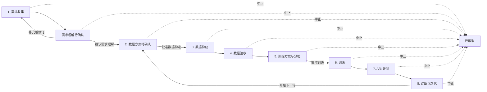

# 个人训练助手安全工作流与可视化改造设计

日期：2026-08-21

范围：`llamafactory_pipeline` 个人训练助手

状态：待用户评审确认后进入详细实施计划与编码

## 1. 背景与问题证据

工作流 `wf_20260821T025145Z_f68c20` 暴露了两个相互关联的问题：

1. 用户只明确表达了“训练 9B 模型”和任务类型“FC”，尚未说明业务场景、当前失败表现和期望目标；规划模型却补出了“提升函数调用参数准确性”的目标。后端只校验目标字段非空，随后直接生成数据方案，并允许进入数据构建。
2. 助手页面主要展示状态名与原始 JSON。数据构建阶段只显示“数据构建中”，用户看不到已经完成的步骤、当前输入、实时进度、拒绝原因、样例和产物；训练、评测和诊断阶段存在同样问题。
3. 数据生成、远程训练和远程评测各自具备停止能力，但个人助手没有统一的“中止整个流程”入口、持久化取消意图和取消后的终态。

根因不是一句提示词写得不够严格，而是工作流缺少独立的需求确认闸门、后端没有区分“用户证据”和“模型假设”，前端也没有稳定的步骤与产物语义模型。

## 2. 改造目标

- 用户尚未确认训练场景与目标时，系统不得生成可执行的数据构建审批，更不得启动外部任务。
- 助手可以主动给出需求草案和建议，但所有推断必须标为“助手假设”，不能冒充用户已确认事实。
- 用统一的八阶段时间线展示每一步的状态、输入、决策、进度、异常、产物和下一步操作。
- 所有非终态工作流都提供“中止流程”按钮；取消操作持久化、幂等、可恢复，并保留已有产物。
- 保持聊天内容流式输出；耗时外部任务继续由独立 worker 定时监控，不占用聊天进程。
- 改造完成后执行隔离的旧版 A / 新版 B 行为对照，证明新方案不再过早执行，并验证可视化和取消语义。

## 3. 非目标

- 本次不修改 LlamaFactory 的训练算法或模型质量评价门槛。
- 本次不引入多用户、权限系统、多服务器调度或新的任务队列框架。
- 本次 A/B 不启动真实的数据生成、GPU 训练或远程推理；使用隔离数据库、固定模型响应和假工具验证编排行为。
- 中止操作不删除数据集、checkpoint、adapter、预测、评分或报告。
- 不把前端显示文本作为安全闸门；所有执行约束必须由后端状态机和审批事务保证。
- 不自动中止当前已经运行的 `wf_20260821T025145Z_f68c20`。只有用户明确点击中止或调用取消接口后才停止它。

## 4. 设计原则

1. **用户证据优先**：用户明确说过的事实与助手推断分开存储。
2. **确认与执行分离**：确认需求、确认数据方案、启动外部任务是不同的审批动作。
3. **后端投影视图**：后端产生稳定的 `workflow_steps`，前端只负责渲染，不自行猜测业务状态。
4. **副作用持久化**：启动和停止外部任务都先写持久意图，再由可续租的 worker 执行。
5. **终态可审计**：完成、失败和取消都保留过程证据和产物引用。
6. **向后兼容、失败关闭**：旧工作流可以查看和取消；缺少确认记录的新动作不得被放行。

## 5. 目标流程



数据方案只能在需求确认后创建。对已经开始的数据、训练或评测任务，中止先进入 `cancelling`，外部任务确认停止后才进入 `cancelled`。

## 6. 需求理解合同

### 6.1 `RequirementDraft`

需求抽取不再直接返回可执行的 `TrainingObjective`，而是先产生草案：

```json
{
  "scenario": {
    "value": "客服系统中的函数调用",
    "source": "user",
    "evidence_message_ids": [12]
  },
  "current_problem": {
    "value": "复杂参数经常缺失",
    "source": "user",
    "evidence_message_ids": [12]
  },
  "desired_behavior": {
    "value": "必填参数完整且类型正确",
    "source": "user",
    "evidence_message_ids": [12]
  },
  "task_types": {
    "value": ["fc"],
    "source": "user",
    "evidence_message_ids": [11]
  },
  "base_model_path": {
    "value": "/data/wangzhengyan/Qwen3.5-9B/",
    "source": "user",
    "evidence_message_ids": [10]
  },
  "data_source": {
    "value": {"fc_seed_file": "..."},
    "source": "default",
    "evidence_message_ids": []
  },
  "success_criteria": {
    "value": {"primary_metric": "param_score_mean", "min_improvement": 0.15},
    "source": "assistant_assumption",
    "evidence_message_ids": []
  },
  "missing_fields": [],
  "assumptions": ["默认以参数准确性作为主指标"],
  "ready_for_review": true
}
```

字段来源只允许：

- `user`：能够回溯到用户消息 ID 的明确陈述。
- `default`：系统配置提供的模型路径、模板或已登记数据源。
- `assistant_assumption`：模型建议或从模糊语句推断出的内容。

### 6.2 必须确认的核心信息

以下信息缺失时不得进入需求确认页：

- 业务场景：模型在什么系统或业务步骤中使用。
- 当前问题：现有模型具体错在哪里，至少要有一种可观察失败表现。
- 期望行为：训练后希望模型怎样变化。
- 任务类型：`qa | qa_multi | fc`。
- 基座模型：明确路径或从受信配置中选择。
- 数据来源：与任务类型兼容且可读取。
- 成功标准：主指标、最小改善和不可回归指标；可由助手提出默认值，但必须在需求确认卡上显式展示。

`scenario`、`current_problem` 和 `desired_behavior` 至少必须有用户证据，不能全部由助手推断。用户只说“9B”和“FC”时，助手应给出一个可编辑的推荐框架并最多集中追问缺失的三项核心信息，不能生成数据方案。

为了避免助手退化成连续问卷，第一次回复必须先展示“暂定训练方案框架”，包括推荐任务类型、可能的数据构建方式、预期训练方式和 A/B 验证思路；所有尚无用户证据的内容统一标为假设。框架之后再一次性列出当前最关键的最多三个问题。后续回复优先合并用户新信息并更新同一张需求卡，不重复追问已经有证据的字段。

### 6.3 需求确认审批

新增动作 `confirm_requirements`。审批卡展示：

- 业务场景、当前问题、期望行为。
- 模型、任务类型、数据来源。
- 成功标准与关键切片。
- 用户证据引用。
- 助手假设和风险。
- 尚未解决的问题。

只有 `ready_for_review=true`、核心证据校验通过且用户点击“确认需求理解”后，后端才原子完成：

1. 固化不可变的 `confirmed_objective` 与 `objective_hash`。
2. 写入 `requirements_confirmed` 事件。
3. 转入 `data_plan_preparing`，生成数据方案。
4. 生成独立的 `start_datagen` 审批。

确认前的新消息会修订草案并使旧确认审批失效。确认后若用户要改目标，必须点击“修订需求”；这会使尚未执行的数据方案审批失效并回到需求收集，而不是用自然语言偷偷修改已批准目标。

数据方案生成失败时，工作流回到 `requirements_review`，保留已确认目标，展示脱敏失败原因并提供“重试生成方案”操作；不得绕过确认闸门或自动退回一个可执行的默认方案。

## 7. 状态机改造

### 7.1 新状态

```text
collecting_requirements
requirements_review
data_plan_preparing
data_plan_ready
data_generating
data_review
train_plan_ready
preflight_blocked
train_ready
training
train_failed
ab_plan_ready
evaluating
diagnosis_ready
cancelling
cancelled
completed
```

### 7.2 关键新转移

| 当前状态 | 事件 | 新状态 | 说明 |
|---|---|---|---|
| `collecting_requirements` | `requirements_draft_ready` | `requirements_review` | 只创建需求确认审批 |
| `requirements_review` | `requirements_revision_requested` | `collecting_requirements` | 旧确认审批失效 |
| `requirements_review` | `requirements_confirmed` | `data_plan_preparing` | 固化目标，尚未启动外部任务 |
| `data_plan_preparing` | `data_plan_created` | `data_plan_ready` | 创建数据构建审批 |
| 任一非终态 | `cancellation_requested` | `cancelling` | 原子持久化取消意图 |
| `cancelling` | `cancellation_completed` | `cancelled` | 外部任务已停或确认不存在 |
| `cancelling` | `cancellation_retry_scheduled` | `cancelling` | 停止失败，保留重试 |

现有阶段转移保持不变。`completed` 与 `cancelled` 都是终态；终态不再接受规划、审批或取消请求。

### 7.3 安全不变量

- 没有 `requirements_confirmed` 事件和匹配的 `objective_hash`，不得创建 `start_datagen` 审批。
- `start_datagen` 的 `plan_hash` 必须同时绑定 `objective_hash` 和 `data_plan_hash`。
- 一旦进入 `cancelling`，任何启动类审批和 monitor 都不能再推进正常状态。
- 旧租约持有者在取消后不得写回进度或终态；所有写操作继续使用 lease token fencing。
- 取消完成后不删除任务引用和产物引用。

## 8. 统一步骤投影 `workflow_steps`

快照新增后端计算字段 `workflow_steps`。它不是新的事实来源，而是由 workflow、事件、外部任务观察和产物引用确定性投影：

```json
{
  "workflow_steps": [
    {
      "key": "requirements",
      "sequence": 1,
      "title": "需求理解",
      "status": "needs_confirmation",
      "started_at": "2026-08-21T02:51:45Z",
      "finished_at": null,
      "summary": "已识别 FC 任务，仍需确认业务场景和目标",
      "inputs": [],
      "decisions": [],
      "progress": null,
      "artifacts": [],
      "issues": [],
      "actions": ["confirm_requirements", "revise_requirements"]
    }
  ]
}
```

固定八个步骤：

1. `requirements`：需求收集与确认。
2. `data_plan`：数据策略、prompt、预算和冻结规则。
3. `data_build`：数据生成任务。
4. `data_review`：画像、质量闸门和训练/holdout 产物。
5. `train_plan`：训练参数、显存估算和预检。
6. `training`：远程训练进度与产物。
7. `evaluation`：A/B 推理、评分和报告。
8. `diagnosis`：门槛结论、根因与下一轮变更。

步骤状态只允许：

```text
pending | active | needs_confirmation | blocked | failed |
cancelling | cancelled | succeeded | skipped
```

每个步骤的共同字段：

- `started_at`、`updated_at`、`finished_at`。
- `summary`：一句人类可读摘要。
- `inputs`：用户确认过的输入和上游产物。
- `decisions`：确定性决策及理由。
- `progress`：当前值、目标值、百分比、ETA 和最近更新时间。
- `issues`：阻断、警告、失败分类和脱敏说明。
- `artifacts`：名称、类型、hash、大小、预览接口、下载接口和生成时间。
- `actions`：当前允许的确认、修订、重试、跳过或查看操作。

前端不得根据英文事件名拼装步骤逻辑；如果新增事件，只需后端投影器和对应测试更新。

## 9. 各阶段过程与产物

### 9.1 需求理解

- 展示用户事实、系统默认、助手假设三类字段。
- 展示缺失信息及引用到的对话消息。
- 产物：确认后的需求简报、`objective_hash`、可下载 JSON。

### 9.2 数据方案

- 展示每种任务的数据来源、prompt、生成数量、SFT/DPO、Judge、去重、拒绝规则、holdout 和风险。
- 展示方案由哪些需求字段推导而来。
- 产物：DataPlan JSON、规范化 DatagenConfig、plan hash。

### 9.3 数据构建

worker 每次检查时读取真实 job 状态，并只在显著变化或心跳窗口到期时持久化 `datagen_progress`：

```json
{
  "job_id": "20260821T025405Z-ed3cc2",
  "accepted": 188,
  "target": 1000,
  "attempts": 260,
  "acceptance_rate": 0.723,
  "rejects": {"实体": 5, "judge": 17, "去重": 50},
  "eta_seconds": 1260,
  "updated_at": "..."
}
```

- 页面展示 accepted/target、尝试数、接受率、拒绝原因分布、ETA、最近日志摘要和脱敏失败原因。
- 可预览最近通过的有限条样例，不把完整大文件灌入快照。
- 产物：output JSONL、生成报告、日志、manifest、下载链接。

### 9.4 数据验收

- 展示训练集/holdout 数、task/critical slice 覆盖、重复率、空值、长度分布、截断风险、hash。
- 产物：训练数据、冻结评测集、DatasetProfile、质量报告。

### 9.5 训练方案与预检

- 展示 batch、gradient accumulation、epoch、LR、LoRA、cutoff、精度、预计显存、steps 和 ETA，以及每项选择理由。
- 预检矩阵显示 SSH、容器、模型、数据 hash、GPU、BF16、磁盘、输出目录和 checkpoint。
- 产物：TrainConfig、预检报告、approval hash。

### 9.6 训练

- 展示 step/total、epoch、loss、eval loss、learning rate、tokens/s、GPU 显存、ETA 和异常 episode。
- 产物：训练 YAML、trainer log、metrics、checkpoints、最终 adapter 和下载链接。

### 9.7 A/B 评测

- 展示已批准的 baseline/candidate 路径与模板、冻结评测集 hash、推理进度、评分进度和无效输出率。
- 产物：predictions、scores、完整 report、paired comparison 和失败证据。

### 9.8 诊断与迭代

- 展示主指标差值、非回归闸门、critical slice、paired n、置信证据、失败分类和代表性样例。
- 若未通过，明确区分数据覆盖、数据质量、欠拟合、过拟合、评测证据质量和系统错误。
- 产物：诊断报告、下一轮 DataPlan/TrainingPlan 差异、接受/结束/开始迭代操作。

## 10. 手动中止设计

### 10.1 API

新增：

```http
POST /api/assistant/workflows/{workflow_id}/cancel
Content-Type: application/json

{"reason":"用户手动中止"}
```

返回最新快照。重复请求返回同一个取消意图和当前进度，不创建新的外部停止任务。

### 10.2 持久化顺序

单个数据库事务完成：

1. 校验当前为非终态。
2. 写 `cancel_request_id`、`cancel_reason`、`cancel_requested_at`。
3. 状态迁移到 `cancelling` 并追加 `cancellation_requested` 事件。
4. 将所有 pending 审批置为 `stale`。
5. 将正常 monitor 标为 cancelled，阻止其继续推动工作流。
6. 按当前外部任务类型创建唯一的 `cancel_external_job` scheduled action；没有外部任务时直接完成取消。

停止外部任务不在 HTTP 请求中同步长时间执行，worker 获取带 token 的租约后调用：

- 数据生成：`datagen_job.stop(job_id)`。
- 训练：`remote.stop_job(config, train_job_id)`。
- 评测：`remote.stop_job(config, eval_id)`。

### 10.3 完成与重试

- 停止返回“已停止”“已终止”“不存在”或观察到明确终态时，原子写 `cancellation_completed` 并进入 `cancelled`。
- 暂时无法连接服务器、身份校验不完整或停止回执不确定时，保持 `cancelling`，记录脱敏问题并指数退避重试。
- 永久配置错误转为 `cancellation_needs_attention` 事件，但仍保持可继续重试，不伪装成已取消。
- 所有完成/重试写入都校验 lease token，取消前取得的 monitor 租约不能覆盖取消状态。

### 10.4 产物保留

取消后保留：

- 已接受的数据记录、manifest、日志和报告。
- 已写入的 checkpoint、adapter 片段与训练指标。
- 已生成的 predictions、scores 和部分报告。
- 对应 hash、job ID、停止回执和取消时间。

UI 明确标注“流程已取消，已有产物未删除”，并继续提供预览与下载。

## 11. 前端设计

助手页面分为三层：

1. 顶部：工作流标题、轮次、总体状态、最近更新时间和醒目的“中止流程”按钮。
2. 中部：八阶段纵向时间线；默认展开当前步骤，完成步骤显示摘要，失败/阻断步骤自动展开。
3. 侧栏或步骤详情：产物、审批、日志摘要和可执行操作。

交互要求：

- “中止流程”需要二次确认，文案说明会停止当前外部任务但保留产物。
- `cancelling` 状态禁用重复点击并显示“正在停止远程任务”。
- 需求确认卡中的助手假设使用不同颜色，并要求用户明确确认。
- 进度通过现有事件轮询增量更新；聊天回复继续使用 SSE 流式输出。
- 原始 JSON 移入“查看技术详情”，不再作为默认主视图。
- 所有按钮是否可用以后端 `actions` 字段为准。
- 时间线满足键盘操作和文字状态提示，不能只依赖颜色。

## 12. API 与数据兼容

### 12.1 快照扩展

现有 `GET /api/assistant/workflows/{id}` 保持原字段并新增：

- `requirement_draft`
- `confirmed_objective`
- `workflow_steps`
- `cancel_request`
- `available_actions`

现有前端和测试可逐步迁移，不需要一次删除原字段。

### 12.2 旧工作流

- 已处于执行阶段的旧工作流按已有事件投影时间线，不伪造需求确认事件。
- 旧工作流详情显示“历史流程未使用独立需求确认闸门”的警告。
- 旧工作流允许中止，使用已有 job ID 进入统一取消路径。
- 新代码不得为旧的 `collecting_requirements` 工作流自动创建数据方案；只有新确认动作能继续。
- 不回写或改变正在运行的历史任务，除非用户主动中止。

## 13. 错误处理与安全

- RequirementDraft、确认目标、步骤投影和取消载荷均使用严格 Pydantic schema，拒绝额外字段。
- 用户证据引用必须属于当前 workflow 且角色为 user。
- 规划模型输出非法时保留对话，写脱敏错误事件并继续需求收集，不产生审批。
- 事件与 UI 只存错误分类、脱敏摘要和 artifact reference，不写 API key、SSH identity 内容或完整日志。
- 产物预览限制行数和单行长度；下载沿用现有安全路径校验。
- 停止操作必须复用 PID/starttime/job marker 身份校验，不能按模糊进程名杀进程。
- 取消、审批和 monitor 的状态更新必须在 store 层 compare-and-set，不能仅依赖前端禁用按钮。

## 14. 测试策略

### 14.1 单元与状态机测试

- 模糊输入不会生成 `TrainingObjective`、DataPlan 或 `start_datagen` 审批。
- “9B”后跟“FC”仍停在需求收集，并列出场景、问题、期望行为的缺口。
- 显式完整场景进入 `requirements_review`，但未确认时没有数据方案。
- 确认需求后才创建绑定 objective hash 的数据方案和审批。
- 修订需求会 stale 旧确认和数据方案审批。
- 八阶段投影在每个状态、失败、重试、跳过、完成和取消分支都稳定。
- datagen/training/evaluation 进度字段由真实观察产生，异常字段失败关闭。
- 取消事务、重复取消、无外部任务取消、停止暂时失败、服务重启后续跑均正确。
- 取消后的旧 monitor/旧租约不能推动状态。
- 取消后所有已存在的 artifact reference 保留。

### 14.2 API 与前端测试

- 快照包含 `workflow_steps`、产物和可用动作。
- 取消接口幂等，终态取消返回明确冲突。
- SSE 聊天仍按 `progress -> assistant_delta -> snapshot -> done` 输出。
- 时间线渲染八个步骤、进度、问题、产物和审批。
- 中止按钮只在非终态显示，二次确认后调用正确接口。
- `cancelling`、`cancelled`、失败和 blocked 状态有文本和无障碍标识。
- 使用浏览器进行本地 mocked UI 烟测，不触发真实外部任务。

### 14.3 行为 A/B 测试

在隔离临时数据库中运行同一组脚本：

- A：改造前的已归档行为或等价的基线实现。
- B：改造后的新实现。
- Planner、工具、服务器观察全部使用固定 fixture，禁止真实数据构建、训练和评测。

用例：

1. `我想训练9b模型`。
2. 在用例 1 后补充 `fc`。
3. 明确业务场景、当前问题、期望行为和成功目标。
4. 用户确认需求理解。
5. 用户批准数据构建。
6. 分别在数据构建、训练、评测时中止。
7. 中止后重复请求并模拟进程重启。

指标：

| 指标 | A 组记录 | B 组验收 |
|---|---|---|
| `premature_execution_rate` | 记录基线实际值 | 必须为 0 |
| 核心需求用户证据覆盖率 | 记录基线实际值 | 执行前必须为 100% |
| 审批顺序正确率 | 记录基线实际值 | 必须为 100% |
| 八阶段可视化覆盖率 | 记录基线实际值 | 8/8，且当前阶段有进度或明确空态 |
| 产物引用覆盖率 | 记录基线实际值 | 已生成产物 100% 可定位 |
| 取消成功率 | 基线无统一语义 | 受控用例必须为 100% |
| 取消幂等率 | 基线无统一语义 | 必须为 100% |
| 取消后产物保留率 | 记录基线实际值 | 必须为 100% |

A/B 报告必须逐用例列出状态序列、创建的审批、外部工具调用次数、步骤投影和取消结果。不能只报告测试用例通过数。

## 15. 验收标准

- 对“我想训练 9B 模型”再补“FC”的输入，助手可以给方案框架和集中问题，但没有任何 datagen 外部调用。
- 用户明确场景、问题和目标后，只进入“需求理解待确认”。
- 用户点击“确认需求理解”后才生成数据方案；用户再批准数据方案后才启动数据构建。
- 页面始终显示八个阶段，当前阶段能看到过程数据、最近更新时间和已有产物。
- 数据生成时能看到 accepted/target、接受率、拒绝原因和 ETA；训练与评测有对应进度与产物。
- 所有非终态工作流可以中止，重启服务后取消仍能继续，最终进入 `cancelled`。
- 中止不会删除或丢失已有产物。
- 聊天保持流式输出，定时监控不占用聊天请求。
- 隔离 A/B 满足第 14.3 节全部 B 组门槛。
- Python、Node、bash/plist、compile 和 diff 检查全部通过；本地浏览器 mocked acceptance 通过后才重启正式服务。

## 16. 实施顺序

1. 以测试锁定需求证据、确认闸门和新状态机。
2. 实现 RequirementDraft、确认/修订 API 与原子审批。
3. 实现八阶段后端投影及进度/产物合同。
4. 增加 datagen、training、evaluation 的统一进度事件。
5. 以测试锁定取消事务、租约 fencing 和外部停止适配。
6. 实现取消 API、worker 和工具适配。
7. 重构助手前端为步骤时间线、产物卡和中止交互，保留 SSE。
8. 跑隔离 A/B 并生成对照报告。
9. 跑完整回归和本地浏览器验收。
10. 仅在验证通过后合入并重启前后端与 assistant monitor。

## 17. 设计取舍

未采用“只改提示词和前端”的方案，因为它无法阻止后端在模型误判时执行，也无法保证取消的原子性。未进行完整事件溯源重构，因为现有 SQLite workflow、events、approval 和 scheduled action 已能承载安全改造；新增需求确认状态、步骤投影和 durable cancellation 可以在现有架构内完成，范围更可控。
